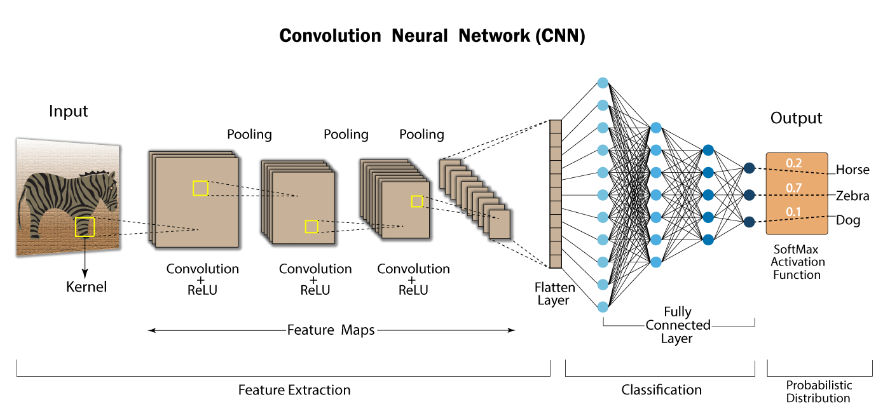

## CNN Introduction

### What are Convolutional Neural Networks (CNNs)
---
Convolutional neural networks (CNNs) are a subset of deep learning neural networks, which themselves fall under machine learning, focusing on learning hierarchical feature representations from data. They are specifically designed to handle to two-dimensional data, such as images, by exploiting special localit. CNNs are commonly used in computer vision, enabling computers to interpret visual data, such as recongnizing objects in images or videos.

The architecture of CNNs is inspired by the visual perception. A biological neuron corresponds to an artificial neuron; CNN kernels represent different receptors that can respond to various features; activation functions simulate the function that only neuron electric signals exceeding a certain threshold can be transmitted to the next neuron. Loss functions and optimization are something people invented to teach the whole CNN system to learn what we expected.

### Advantages of CNNs
---
Compared with general artificial neurons, CNN possesses many advantages:
1. **Local Connections:** Each neuron is no longer connected to all neurons of the previous layer, but only to a small number of neurons, which is effective in reducing the parameters and speed up convergence.
2. **Weight Sharing:** A group of connections can share the same weights, which reduces parameters even furthur.
3. **Downsampling Dimension Reduction:** A pooling layer harness the principle of image local correlations to downsample an image, which can reduce the amount of data while retaining useful information. It can also reduce the number of parameters by removing trivial features.
4. **Hierarchical Feature Learning:**  Lower layers often learn simple features (e.g., edges), while deeper layers can learn more complex patterns (e.g., object parts), enabling robust representations for high-level tasks.

### Basic CNN Components
---
 
>> Image source: [analyticsvidhya](https://www.analyticsvidhya.com/blog/2022/03/basics-of-cnn-in-deep-learning/)

Many CNN models follow a fixed structure: an input layer, alternating convolution and pooling layers that form a feature extractor, fully connected layers with activation functions, and an output layer. The feature extractor converts raw input into higher level representations, which are then used for tasks like classification or regression. Additional componentssuch as batch normalization and dropout furthur enhance performance.

1. **Convolutional Layers:** Convolutional layers are the foundation of CNNs, designed to extract features from input data, such as edges, textures, or shapes in images. They use filters (kernels), which are small matrices (e.g., 3x3 or 5x5) that slide over the input data, performing a convolution operation. This operation involves computing the dot product between the filter and a local region of the input, producing a feature map that highlights the presence of specific patterns.
2. **Pooling Layers:** Pooling layers follow convolutional layers and reduce the spatial dimensions (width and height) of feature maps, making the network more computationally efficient and less prone to overfitting. Pooling acts like a summarization step, retaining important information while discarding less critical details.
3. **Activation Functions:** Activation functions introduce non-linearity into the network, allowing it to learn complex patterns that linear operations alone cannot capture. Without non-linearity, a deep network would behave like a single linear transformation, limiting its power. The most popular activation function in CNNs is ReLU, defined as $f(x)=max(0, x)$.
4. **Fully connected Layers:** Fully connected layers are typically placed at the end of a CNN and are responsible for making predictions, such as classifying an image into categories (e.g., "cat" or "dog").
5. **Batch Normalization:** Batch normalization stabilizes and accelerates training by normalizing the inputs to each layer within a mini-batch. It is typically applied before the activation function in convolutional or fully connected layers.
6. **Dropout:** Dropout is a regularization technique that prevents overfitting by randomly deactivating neurons during training.

**References:**
- Z. Li, F. Liu, W. Yang, S. Peng and J. Zhou, "[A Survey of Convolutional Neural Networks: Analysis, Applications, and Prospects](https://ieeexplore.ieee.org/document/9451544)," in IEEE Transactions on Neural Networks and Learning Systems, vol. 33, no. 12, pp. 6999-7019, Dec. 2022, doi: 10.1109/TNNLS.2021.3084827. 
- Zhao, X., Wang, L., Zhang, Y. et al. [A review of convolutional neural networks in computer vision](https://doi.org/10.1007/s10462-024-10721-6). Artif Intell Rev 57, 99 (2024). 

## Modern CNN architectures

